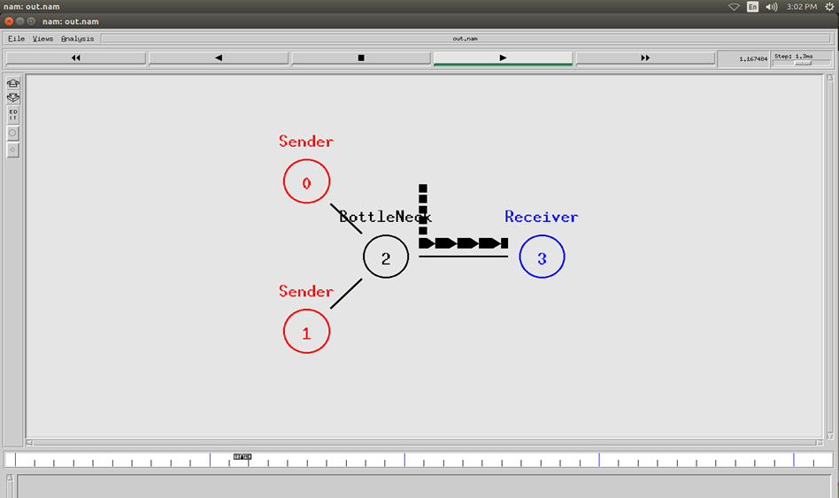
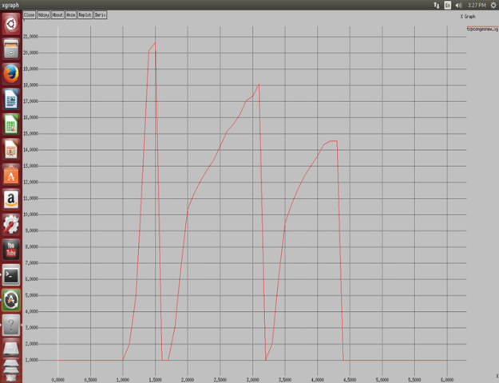
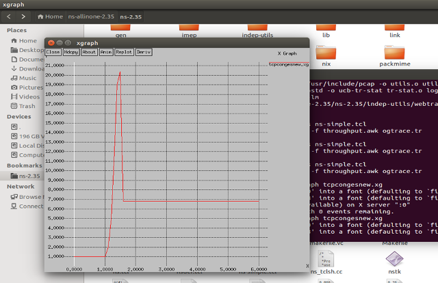

# congestion-control-wired
(2015-2016)
Congestion Control in Wired Networks implemented in NS-2.

Controlling Congestion in a Network Improves Efficiency.

What is NS2?
NS2 stands for Network Simulator Version 2
It is an open-source event-driven simulator designed specifically for research in computer communication networks. 

The Repository includes 
1. <b>improved tcp.h</b> and <b>tcp.cc</b> implemented by Network Simulator 2
popularly known as NS-2.
2.TCL file with two TCP generator nodes and one receiver with one intermidiate node.

3. Standard Results - Includes .xg (graph),  .awk files for analyzing efficiency, packet drops, etc, Trace files.
4. Improved Results - Includes Graphs, awk files, trace files

<h3>Standard Algorithm</h3>

Cwnd = Number of packets sent at a time.

1.	Cwnd window opens (extends) at every acknowledgement by receiver.
2.	It calls opencwnd() function which increments number of packets that will be sent at a time (cwnd) once it reaches threshold (ssthresh) TCP will enter congestion avoidance state and then slowing down starts. 
3.	When packets will get lost (Because of Congestion, Queues full, bottleneck) there will be presence of duplicate acknowledgements. Thus slowdown () will be called. 
4.  In Standard Algorithm Slowdown Resets cwnd window and increased slowly again when acknowledgements are received and will reset again if packets are lost.

<h3> Improved Algorithm </h3>

1. When packets are dropped there will be presence of duplicate acknowledgements. Thus slowdown () will be called. 
2. At that time current cwnd's value will be stored in variable and cwnd will be given new value which will be current cwnd divided by number of tcp traffic sources. 

Example
1. Queue at bottle neck is 10
2. There are 2 tcp traffic generators in network.
3. If cwnd is 5, both sources will send 5 packets which will add up to 10 and queue at intermidiate node is 10 so no packet loss.
3. Now, Packets get lost when cwnd is 10 meaning each tcp generator sending 10 packets
4. 10+10=20 AND QUEUE is only for 10 which will result in packet drop.
5.Now, set  cwnd=cwnd/N     cwnd is current cwnd window value AND N is the number of tcp traffic generators
i.e.  cwnd=10/2 which is 5.
6. Both sources will send 5 packets (5+5=10 Total) queue is 10 so no packet loss with optimum packets transfer.
7. Now this will not get incremented again since it is already transmitting as fast as possible without losing packets anymore.

